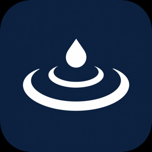
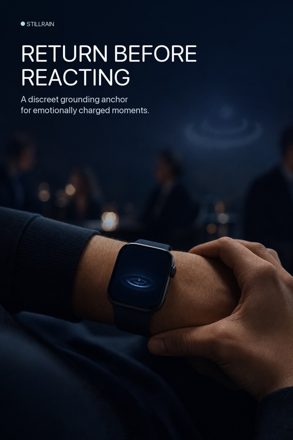
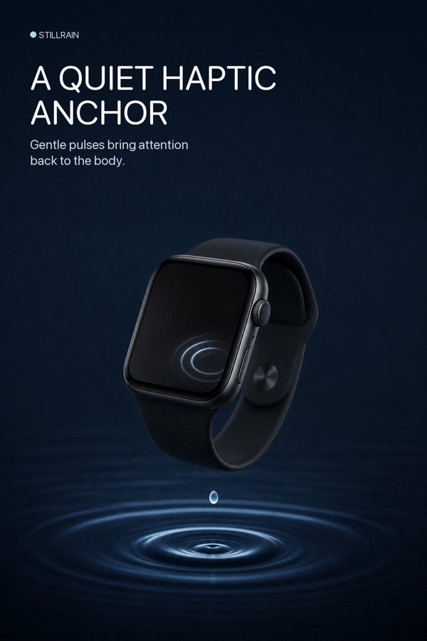
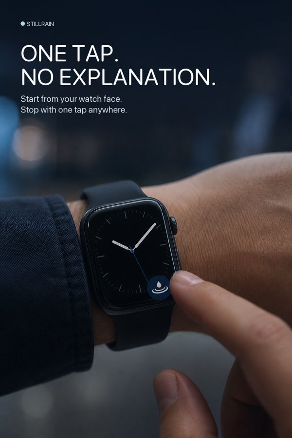
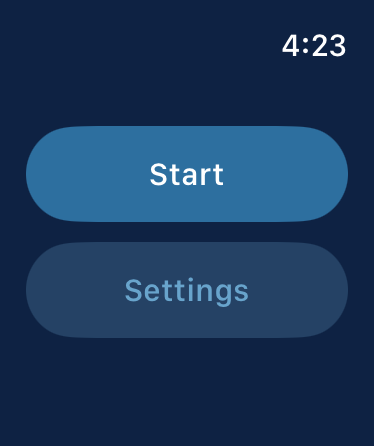
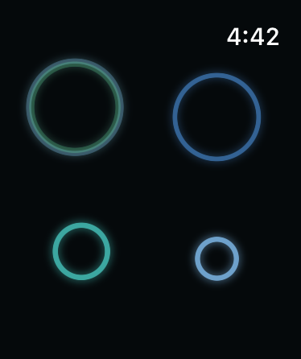

  

<h1 align="center">StillRain</h1>

<em>A quiet return before reaction.</em>

  A private, one-tap grounding practice for Apple Watch.

---

Consciousness forgets.

In moments of fear, tension, shame, overwhelm, or conflict, even what we know
deeply can become difficult to remember. StillRain offers a small way back:
gentle haptic pulses, a dark rain surface, and no demand to explain or perform.

Begin from the watch face. Let the pulse return attention to the body. When
you are ready, tap once to release the moment.

> The watch should not ask for attention. It should return attention to the body.

## A simple ritual

| Begin | Return | Release |
|:---:|:---:|:---:|
| Tap the complication from the watch face. | Feel a quiet haptic rhythm as soft ripples appear. | Tap anywhere to stop; minimal context is saved locally. |

## In stillness

<table>
  <tr>
    <td width="33.33%"></td>
    <td width="33.33%"></td>
    <td width="33.33%"></td>
  </tr>
</table>

## On the watch

  
  &nbsp;&nbsp;&nbsp;
  

  Nothing to study. Nothing to score. Begin, feel, and return.

## Designed with restraint

- **Immediate grounding** — one tap from a watch-face complication begins the
  practice.
- **Quiet haptics** — choose a steady or varied pulse pattern, pace, and
  duration.
- **Still rain** — each pulse can meet the dark surface as a restrained ripple;
  the Digital Crown adjusts its visibility.
- **One-tap release** — the entire active screen is the stop control.
- **Gentle reflection** — sessions remember time, duration, moon phase, and,
  only if enabled, coarse location.

StillRain is not a stress score, a meditation streak, or a record of what was
said. It is closer to touching a mala bead or placing a hand on the heart: a
small physical reminder that another response remains possible.

## Privacy is part of the practice

The app is intentionally local-only and minimal.

- No microphone or audio recording
- No HealthKit or biometric data
- No accounts, ads, analytics, or cloud service
- No AI interpretation of private moments
- Optional coarse location, off unless you enable it
- On-device moon-phase calculation
- Local history that you can delete at any time

The aim is reflection without surveillance—even self-surveillance.

## Philosophy

StillRain grows from an unpublished living manuscript,
*A Catalyst-Conscious Life*. Its premise is that difficult moments need not be
treated as punishment or proof of failure. They can be met as catalyst: an
invitation to notice what has closed, preserve freedom of choice, and return
gently to an open heart.

The project follows a few vows:

- Prefer presence, without forcing it.
- Let technology support awareness, not replace it.
- Care for the instrument.
- Preserve privacy and free will.
- Do not measure service by grandeur.
- When capacity is low, keep one small flame of awareness alive.

StillRain does not promise perfect calm. Rain still falls. The practice is to
meet the surface before the first ripple becomes a wave.

## Built as a focused watchOS app

- SwiftUI interface for watchOS 11+
- WatchKit haptic engine with configurable pulse patterns
- WidgetKit watch-face complication and deep-link launch
- Local session persistence and offline moon-phase calculation
- Accessibility-aware motion and luminance behavior
- Unit-tested session, haptic, visual, storage, and complication logic

Open `CatalystBell.xcodeproj` in Xcode and run the
`CatalystBellWatchApp` scheme on an Apple Watch simulator or device. The
internal target names still reflect the project's working title while the
public identity transitions to StillRain.

## Maker

Created with care by [Sizhan Shi](https://github.com/koyarei).

<!-- Add the public resume URL beside the maker link once confirmed. -->

---

<em>Return gently. All is well.</em>

